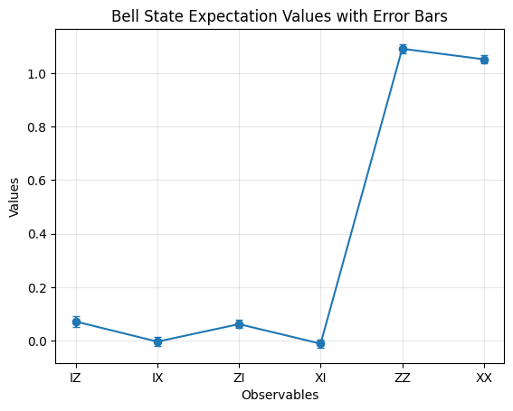
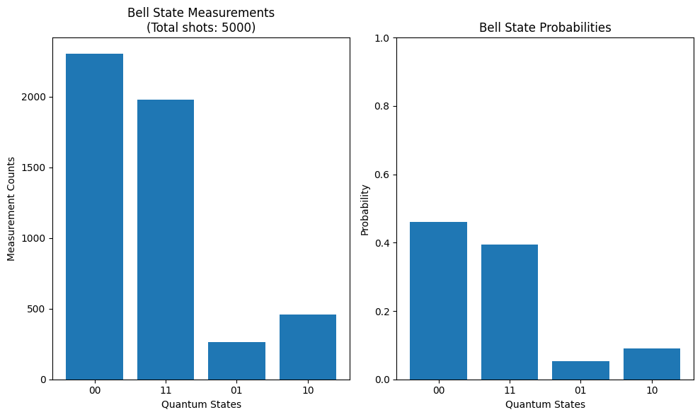

# Hello World

In this tutorial I'll be following along a simple demonstration of setting up a **quantum program**, and running it on a **quantum processing unit (QPU)**. You have to start somewhere, and the best place is usually from the beginning. 

Along this tutorial in which we will be creating a simple Bell state circuit, the quantum version of Hello World!

But I'll be adding an additional layer of commentary, and making it my own, to help turn this tutorial into something that a mere mortal might be able to understand. If one comes away from this understanding 10% of what is going on, one is doing very well. Better than me...

Of course, I skipped over the introductions course. The best learning is done through doing! Working with your hands, rather than pondering in the skies. 

Ref: https://quantum.cloud.ibm.com/docs/en/tutorials/hello-world

#### On a side note

You may be thinking, what is the point? Why not just follow along with the tutorial and do it. Well for two reasons, #1 the referenced tutorial makes no sense to an actual human, #2 it is very easy to just mindlessly copy and execute code, and feel that satisfaction of doing. But to actually understand what's happening, and the underlying calculations. That's a whole another pursuit. I'm not saying I even come close to be successful here. But maybe one day.

### What is a Bell state circuit?

A Bell state circuit is made up of two gates, the Hadamard gate and a CNOT gate, more on this laters. The combination of these two circuits allow you to investigate the Bell states. Essentially, the 4 states that are created when two qubits are entangled. 

*these are also known as EPR states*

The four bell states:
|β₀₀⟩ = (|00⟩ + |11⟩) / √2
|β₀₁⟩ = (|01⟩ + |10⟩) / √2
|β₁₀⟩ = (|00⟩ - |11⟩) / √2
|β₁₁⟩ = (|01⟩ - |10⟩) / √2

#### What this actually means

The end states are denoted as |β₀₀⟩, |β₀₁⟩, |β₁₀⟩, |β₁₁⟩, also known as  Φ⁺, Φ⁻, Ψ⁺, Ψ⁻

- |00⟩ = both qubits in state 0
- |01⟩ = first qubit in state 0, second qubit in state 1  
- |10⟩ = first qubit in state 1, second qubit in state 0
- |11⟩ = both qubits in state 1

*In dirac notion, the first number in the brackets is the first qubit, the second the second. 

#### The mathematics

1. You start with the initial state of |00⟩

2. Application of the Hadamard gate put it into a superposition of |0⟩ and |1⟩: (|00⟩ + |10⟩)/√2 

3. CNOT gate then flips the second qubit, depending on the first: (|00⟩ + |11⟩)/√2 = |β₀₀⟩. We can see that in the first |00 becayse the first qubit is 0, the second doesnt flip, but then in the second because the first is 1, the second is now 1. 

4. The main point is that because the second qubit depends on the superposition of the first, this means the two qubits are entangled. If this doesn't immediately make sense, neither. But let's proceed forth in ignorance for now. Some understanding just takes time. 


## Step 1. Crafting Quantum Instructions

Quantum Circuits are the human, visual interface that we craft a set of intructions that a Quantum Computer can action. We will be using the Qiskit SDK here. I'll try to explain the code as we go along


```python
from qiskit import *


# Create a Quantum Circuit with 2 qubits using qiskit
qc = QuantumCircuit(2)

# Apply Hadamard gate to the first qubit
qc.h(0) 

# Apply CNOT gate with control qubit 0 and target qubit 1
qc.cx(0, 1)


qc.draw()

```


<pre style="word-wrap: normal;white-space: pre;background: #fff0;line-height: 1.1;font-family: &quot;Courier New&quot;,Courier,monospace">     ┌───┐     
q_0: ┤ H ├──■──
     └───┘┌─┴─┐
q_1: ─────┤ X ├
          └───┘</pre>


## Step 2. Setting up the output

In the world of Qiskit, you can return data in two fashions, a probability distribution across a set of qubits, or the expectation value of an observable. 

### Probability Distribution
Shows frequency of each state e.g. frquency of measuring 00, 01, 10, 11

### Expectation Values
"Gives yuo quantum mechanical averages"...yeah I can't think of a good way to explain this, so maybe I'll try to show you.

As, in this example, we measure expectation values.

To do this, we need to create 6 two-qubit Pauli Operators: IZ, IX, ZI, XI, ZZ, XX. 

### What are these you ask?

Well before we start with the two, we should probably start with the single qubit pauli matrices

The Four Pauli Matrices

#### I (Identity Matrix)
I = (1  0)
    (0  1)

Effect: Does nothing - leaves the qubit unchanged
Physical meaning: No operation applied
On |0⟩: I|0⟩ = |0⟩
On |1⟩: I|1⟩ = |1⟩

#### X (Pauli-X / NOT Gate)
X = (0  1)
    (1  0)
Effect: Flips the qubit state (bit flip)
Physical meaning: Rotation around X-axis of Bloch sphere
On |0⟩: X|0⟩ = |1⟩
On |1⟩: X|1⟩ = |0⟩

#### Y (Pauli-Y)

Y = (0  -i)
    (i   0)

Effect: Combines bit flip and phase flip
Physical meaning: Rotation around Y-axis of Bloch sphere
On |0⟩: Y|0⟩ = i|1⟩
On |1⟩: Y|1⟩ = -i|0⟩

#### Z (Pauli-Z / Phase Flip)
Effect: Flips the phase (leaves |0⟩ unchanged, adds minus sign to |1⟩)
Physical meaning: Rotation around Z-axis of Bloch sphere
On |0⟩: Z|0⟩ = |0⟩
On |1⟩: Z|1⟩ = -|1⟩


### TLDR

So long story short, the way I like to think of it (perhaps wrongly) is the these operators represent the change to the qubits value that we might expect. The expectation value of an operator is the average outcome that you would obtain 

So I represents no change before and after the quantum circuit, Y is a flip in the Y axis, and Z is a rotation in the Z axis. 

## Back to two-bit Pauli Operators


```python
# We use SparsePauliOp from the quantum_info to define observables
from qiskit.quantum_info import SparsePauliOp


observables = [
    SparsePauliOp("IZ"),  # Measures qubit 1 in Z basis
    SparsePauliOp("IX"),  # Measures qubit 1 in X basis
    SparsePauliOp("ZI"),  # Measures qubit 0 in Z basis  
    SparsePauliOp("XI"),  # Measures qubit 0 in X basis
    SparsePauliOp("ZZ"),  # Measures correlation between both qubits in Z basis
    SparsePauliOp("XX"),  # Measures correlation in X basis
]

# Let's see what these mean mathematically
for obs in observables:
    print(f"{obs}: Matrix shape {obs.to_matrix().shape}")
    print(f"Matrix:\n{obs.to_matrix()}\n")

```

    SparsePauliOp(['IZ'],
                  coeffs=[1.+0.j]): Matrix shape (4, 4)
    Matrix:
    [[ 1.+0.j  0.+0.j  0.+0.j  0.+0.j]
     [ 0.+0.j -1.+0.j  0.+0.j  0.+0.j]
     [ 0.+0.j  0.+0.j  1.+0.j  0.+0.j]
     [ 0.+0.j  0.+0.j  0.+0.j -1.+0.j]]
    
    SparsePauliOp(['IX'],
                  coeffs=[1.+0.j]): Matrix shape (4, 4)
    Matrix:
    [[0.+0.j 1.+0.j 0.+0.j 0.+0.j]
     [1.+0.j 0.+0.j 0.+0.j 0.+0.j]
     [0.+0.j 0.+0.j 0.+0.j 1.+0.j]
     [0.+0.j 0.+0.j 1.+0.j 0.+0.j]]
    
    SparsePauliOp(['ZI'],
                  coeffs=[1.+0.j]): Matrix shape (4, 4)
    Matrix:
    [[ 1.+0.j  0.+0.j  0.+0.j  0.+0.j]
     [ 0.+0.j  1.+0.j  0.+0.j  0.+0.j]
     [ 0.+0.j  0.+0.j -1.+0.j  0.+0.j]
     [ 0.+0.j  0.+0.j  0.+0.j -1.+0.j]]
    
    SparsePauliOp(['XI'],
                  coeffs=[1.+0.j]): Matrix shape (4, 4)
    Matrix:
    [[0.+0.j 0.+0.j 1.+0.j 0.+0.j]
     [0.+0.j 0.+0.j 0.+0.j 1.+0.j]
     [1.+0.j 0.+0.j 0.+0.j 0.+0.j]
     [0.+0.j 1.+0.j 0.+0.j 0.+0.j]]
    
    SparsePauliOp(['ZZ'],
                  coeffs=[1.+0.j]): Matrix shape (4, 4)
    Matrix:
    [[ 1.+0.j  0.+0.j  0.+0.j  0.+0.j]
     [ 0.+0.j -1.+0.j  0.+0.j  0.+0.j]
     [ 0.+0.j  0.+0.j -1.+0.j  0.+0.j]
     [ 0.+0.j  0.+0.j  0.+0.j  1.+0.j]]
    
    SparsePauliOp(['XX'],
                  coeffs=[1.+0.j]): Matrix shape (4, 4)
    Matrix:
    [[0.+0.j 0.+0.j 0.+0.j 1.+0.j]
     [0.+0.j 0.+0.j 1.+0.j 0.+0.j]
     [0.+0.j 1.+0.j 0.+0.j 0.+0.j]
     [1.+0.j 0.+0.j 0.+0.j 0.+0.j]]
    


### 🧮 Basis States and Vectors

| State | Vector |
|-------|--------|
| |00⟩ | [1, 0, 0, 0]ᵀ |
| |01⟩ | [0, 1, 0, 0]ᵀ |
| |10⟩ | [0, 0, 1, 0]ᵀ |
| |11⟩ | [0, 0, 0, 1]ᵀ |

### 🧪 Example: Apply Matrix M SparsePauliOp(['IZ'], to |01⟩

Let's multiply matrix SparsePauliOp(['IZ'], by the vector for |01⟩:

$$
M =
\begin{bmatrix}
1 & 0 & 0 & 0 \\
0 & -1 & 0 & 0 \\
0 & 0 & 1 & 0 \\
0 & 0 & 0 & -1
\end{bmatrix}
,\quad
|01⟩ =
\begin{bmatrix}
0 \\
1 \\
0 \\
0
\end{bmatrix}
$$

$$
M \cdot |01⟩ =
\begin{bmatrix}
1 & 0 & 0 & 0 \\
0 & -1 & 0 & 0 \\
0 & 0 & 1 & 0 \\
0 & 0 & 0 & -1
\end{bmatrix}
\cdot
\begin{bmatrix}
0 \\
1 \\
0 \\
0
\end{bmatrix}
=
\begin{bmatrix}
0 \\
-1 \\
0 \\
0
\end{bmatrix}
= -1 \cdot |01⟩
$$

✅ **Result**: The state remains |01⟩, but acquires a global phase of **−1**.

### Moving on

So we have set up the observables. But there are a couple of things that we need to do:

1. We need to confirm our intrsuctions to the backend devices Instruction Set Architecture

I'm going to be doing this on a live machine. 

#### What the hell is the Instruction Set Architecture (ISA)?


```python
from qiskit_ibm_runtime import QiskitRuntimeService
import os
from dotenv import load_dotenv

# Load environment variables from .env file
load_dotenv()

# Get credentials from environment variables
token = os.getenv('IBM_QUANTUM_TOKEN')
instance = os.getenv('IBM_QUANTUM_INSTANCE')

if token is None:
    raise ValueError("Please set IBM_QUANTUM_TOKEN in your .env file")

# Save and create the service
QiskitRuntimeService.save_account(
    token=token,
    instance=instance,
    overwrite=True
)

service = QiskitRuntimeService()
print("Successfully connected to IBM Quantum!")
print(service.backends)
```

    management.get:WARNING:2025-10-04 10:03:13,130: Loading default saved account


    Successfully connected to IBM Quantum!
    <bound method QiskitRuntimeService.backends of <QiskitRuntimeService>>


```python
from qiskit.transpiler.preset_passmanagers import generate_preset_pass_manager

# I've specifically had issues with the other ones so I use ibm_torino, but you can also use .least_busy()
backend = service.backend('ibm_torino')

pm = generate_preset_pass_manager(backend=backend, optimization_level=1)
#1 = equalling light optimisation

transpiled_qc = pm.run(qc)

print(transpiled_qc)

```

    global phase: 3π/4
             ┌─────────┐┌────┐┌─────────┐                               
    q_0 -> 0 ┤ Rz(π/2) ├┤ √X ├┤ Rz(π/2) ├─■─────────────────────────────
             ├─────────┤├────┤├─────────┤ │ ┌─────────┐┌────┐┌─────────┐
    q_1 -> 1 ┤ Rz(π/2) ├┤ √X ├┤ Rz(π/2) ├─■─┤ Rz(π/2) ├┤ √X ├┤ Rz(π/2) ├
             └─────────┘└────┘└─────────┘   └─────────┘└────┘└─────────┘


```python
for backend in service.backends():
    print(backend.name)
    print(backend.num_qubits)


status = backend.status()
print(f"Backend Status: {status.status_msg}")
print(f"Pending Jobs: {status.pending_jobs}")
```

    ibm_brisbane
    127
    ibm_torino
    133
    Backend Status: active
    Pending Jobs: 659


### What is this Pass Maanger?

So this Pass Manager is essentially the pipeline of transforms that are required to convert your abstract (idealised) quantum circuit into something that can actually be run by the limited quantum hardware.

Due to hardware limitations such as:
- Limited connectivity: Not all qubits can directly interact
- Native gate set: Hardware only supports specific gates (not necessarily H and CNOT)
- Noise and errors: Some sequences are more robust than others

We are required to:
1.  adapt our circuit to the hardware's constraints
2. Optimise the circuit for better performance
3. Map our virtual qubits to the physical qubits on the device


```python

transpiled_qc.draw( idle_wires=False)

```


<pre style="word-wrap: normal;white-space: pre;background: #fff0;line-height: 1.1;font-family: &quot;Courier New&quot;,Courier,monospace">global phase: 3π/4
         ┌─────────┐┌────┐┌─────────┐                               
q_0 -> 0 ┤ Rz(π/2) ├┤ √X ├┤ Rz(π/2) ├─■─────────────────────────────
         ├─────────┤├────┤├─────────┤ │ ┌─────────┐┌────┐┌─────────┐
q_1 -> 1 ┤ Rz(π/2) ├┤ √X ├┤ Rz(π/2) ├─■─┤ Rz(π/2) ├┤ √X ├┤ Rz(π/2) ├
         └─────────┘└────┘└─────────┘   └─────────┘└────┘└─────────┘</pre>


```python
qc.draw()
```


<pre style="word-wrap: normal;white-space: pre;background: #fff0;line-height: 1.1;font-family: &quot;Courier New&quot;,Courier,monospace">     ┌───┐     
q_0: ┤ H ├──■──
     └───┘┌─┴─┐
q_1: ─────┤ X ├
          └───┘</pre>


### Now if we compare all the gates


```python
# Check the gate counts
print(f"\nOriginal gates: {qc.count_ops()}")
print(f"Transpiled gates: {transpiled_qc.count_ops()}")
```

    
    Original gates: OrderedDict({'h': 1, 'cx': 1})
    Transpiled gates: OrderedDict({'rz': 6, 'sx': 3, 'cz': 1})


#### New Gates now include

##### rz - Z-Rotation Gate
What it does: Rotates qubit around the Z-axis of the Bloch sphere.

Why is it used:


##### sx - Square-root-of-X Gate
What it does: Performs a π/2 rotation around the X-axis — halfway between identity and a full bit-flip.

Why is it used: Building block for creating the Hadamard gate. H ≈ RZ(π) · SX · RZ(π)

##### cz - Controlled-Z Gate (1 instance)
What it does: Flips the sign of |11⟩ → −|11⟩.

Why is it used:  Introduces entanglement when combined with Hadamard. H ⋅ CZ ⋅ H = CNOT


This is why transpilation is crucial - it bridges the gap between what's easy for humans to understand and what the quantum hardware can actually execute!

### Executing the circuit and measuring observables

To do this we need primitives! We need to run the circuit multiple times due to random results. Therefore, probability reveals the true answer. In QiSkit there are two primitives: <ZZ> = 0.85

1. The Estimator - gives you the expectation value of observables => A single number representing the quantum mechanical averages e.g. 

2. The Sampler - used to return a probability distributions

Since we set up the observables earlier, let's start with The Estimator!


```python
from qiskit_ibm_runtime import Estimator
# We begin by setting up the estimator primitive

estimator = Estimator(mode=backend)
estimator.options.resilience_level = 1
estimator.options.default_shots = 5000

# mapping your observables to match the physical qubits that your transpiled circuit is using.
mapped_observables = [observable.apply_layout(transpiled_qc.layout) for observable in observables]

print(mapped_observables)

```

    [SparsePauliOp(['IIIIIIIIIIIIIIIIIIIIIIIIIIIIIIIIIIIIIIIIIIIIIIIIIIIIIIIIIIIIIIIIIIIIIIIIIIIIIIIIIIIIIIIIIIIIIIIIIIIIIIIIIIIIIIIIIIIIIIIIIIIIIIIIIIIIZ'],
                  coeffs=[1.+0.j]), SparsePauliOp(['IIIIIIIIIIIIIIIIIIIIIIIIIIIIIIIIIIIIIIIIIIIIIIIIIIIIIIIIIIIIIIIIIIIIIIIIIIIIIIIIIIIIIIIIIIIIIIIIIIIIIIIIIIIIIIIIIIIIIIIIIIIIIIIIIIIIX'],
                  coeffs=[1.+0.j]), SparsePauliOp(['IIIIIIIIIIIIIIIIIIIIIIIIIIIIIIIIIIIIIIIIIIIIIIIIIIIIIIIIIIIIIIIIIIIIIIIIIIIIIIIIIIIIIIIIIIIIIIIIIIIIIIIIIIIIIIIIIIIIIIIIIIIIIIIIIIIZI'],
                  coeffs=[1.+0.j]), SparsePauliOp(['IIIIIIIIIIIIIIIIIIIIIIIIIIIIIIIIIIIIIIIIIIIIIIIIIIIIIIIIIIIIIIIIIIIIIIIIIIIIIIIIIIIIIIIIIIIIIIIIIIIIIIIIIIIIIIIIIIIIIIIIIIIIIIIIIIIXI'],
                  coeffs=[1.+0.j]), SparsePauliOp(['IIIIIIIIIIIIIIIIIIIIIIIIIIIIIIIIIIIIIIIIIIIIIIIIIIIIIIIIIIIIIIIIIIIIIIIIIIIIIIIIIIIIIIIIIIIIIIIIIIIIIIIIIIIIIIIIIIIIIIIIIIIIIIIIIIIZZ'],
                  coeffs=[1.+0.j]), SparsePauliOp(['IIIIIIIIIIIIIIIIIIIIIIIIIIIIIIIIIIIIIIIIIIIIIIIIIIIIIIIIIIIIIIIIIIIIIIIIIIIIIIIIIIIIIIIIIIIIIIIIIIIIIIIIIIIIIIIIIIIIIIIIIIIIIIIIIIIXX'],
                  coeffs=[1.+0.j])]


#### A quick note on the mapping

### Running the job


```python
job = estimator.run([(transpiled_qc, mapped_observables)])
job_id = job.job_id
print(f"Save this Job ID: {job_id}")

result = job.result()
```

    /Users/gatsby.fitzgerald/Library/CloudStorage/OneDrive-Accenture/Development/QuantumPlayground/.venv/lib/python3.12/site-packages/qiskit_ibm_runtime/qiskit_runtime_service.py:955: UserWarning: The backend ibm_torino currently has a status of internal.
      warnings.warn(


    Save this Job ID: <bound method BasePrimitiveJob.job_id of <RuntimeJobV2('d3d1pf6dacis73dbdv50', 'estimator')>>


    ---------------------------------------------------------------------------

    KeyboardInterrupt                         Traceback (most recent call last)

    Cell In[15], line 5
          2 job_id = job.job_id
          3 print(f"Save this Job ID: {job_id}")
    ----> 5 result = job.result()


    File ~/Library/CloudStorage/OneDrive-Accenture/Development/QuantumPlayground/.venv/lib/python3.12/site-packages/qiskit_ibm_runtime/runtime_job_v2.py:126, in RuntimeJobV2.result(self, timeout, decoder)
        111 """Return the results of the job.
        112 
        113 Args:
       (...)    123     RuntimeInvalidStateError: If the job was cancelled, and attempting to retrieve result.
        124 """
        125 _decoder = decoder or self._final_result_decoder
    --> 126 self.wait_for_final_state(timeout=timeout)
        127 if self._status == "ERROR":
        128     error_message = self._reason if self._reason else self._error_message


    File ~/Library/CloudStorage/OneDrive-Accenture/Development/QuantumPlayground/.venv/lib/python3.12/site-packages/qiskit_ibm_runtime/runtime_job_v2.py:245, in RuntimeJobV2.wait_for_final_state(self, timeout)
        241             raise RuntimeJobTimeoutError(
        242                 f"Timed out waiting for job to complete after {timeout} secs."
        243             )
        244         time.sleep(0.1)
    --> 245         status = self.status()
        246 except futures.TimeoutError:
        247     raise RuntimeJobTimeoutError(
        248         f"Timed out waiting for job to complete after {timeout} secs."
        249     )


    File ~/Library/CloudStorage/OneDrive-Accenture/Development/QuantumPlayground/.venv/lib/python3.12/site-packages/qiskit_ibm_runtime/runtime_job_v2.py:162, in RuntimeJobV2.status(self)
        156 def status(self) -> JobStatus:
        157     """Return the status of the job.
        158 
        159     Returns:
        160         Status of this job.
        161     """
    --> 162     self._set_status_and_error_message()
        163     return self._status


    File ~/Library/CloudStorage/OneDrive-Accenture/Development/QuantumPlayground/.venv/lib/python3.12/site-packages/qiskit_ibm_runtime/base_runtime_job.py:202, in BaseRuntimeJob._set_status_and_error_message(self)
        200 """Fetch and set status and error message."""
        201 if self._status not in self.JOB_FINAL_STATES:
    --> 202     response = self._api_client.job_get(job_id=self.job_id())
        203     self._set_status(response)
        204     self._set_error_message(response)


    File ~/Library/CloudStorage/OneDrive-Accenture/Development/QuantumPlayground/.venv/lib/python3.12/site-packages/qiskit_ibm_runtime/api/clients/runtime.py:105, in RuntimeClient.job_get(self, job_id, exclude_params)
         96 def job_get(self, job_id: str, exclude_params: bool = True) -> Dict:
         97     """Get job data.
         98 
         99     Args:
       (...)    103         JSON response.
        104     """
    --> 105     response = self._api.program_job(job_id).get(exclude_params=exclude_params)
        106     logger.debug("Runtime job get response: %s", response)
        107     return response


    File ~/Library/CloudStorage/OneDrive-Accenture/Development/QuantumPlayground/.venv/lib/python3.12/site-packages/qiskit_ibm_runtime/api/rest/program_job.py:59, in ProgramJob.get(self, exclude_params)
         56 if exclude_params:
         57     payload["exclude_params"] = "true"
    ---> 59 return self.session.get(
         60     self.get_url("self"), params=payload, headers=self._HEADER_JSON_ACCEPT
         61 ).json(cls=RuntimeDecoder)


    File ~/Library/CloudStorage/OneDrive-Accenture/Development/QuantumPlayground/.venv/lib/python3.12/site-packages/requests/sessions.py:602, in Session.get(self, url, **kwargs)
        594 r"""Sends a GET request. Returns :class:`Response` object.
        595 
        596 :param url: URL for the new :class:`Request` object.
        597 :param \*\*kwargs: Optional arguments that ``request`` takes.
        598 :rtype: requests.Response
        599 """
        601 kwargs.setdefault("allow_redirects", True)
    --> 602 return self.request("GET", url, **kwargs)


    File ~/Library/CloudStorage/OneDrive-Accenture/Development/QuantumPlayground/.venv/lib/python3.12/site-packages/qiskit_ibm_runtime/api/session.py:328, in RetrySession.request(self, method, url, bare, **kwargs)
        326 try:
        327     self._log_request_info(final_url, method, kwargs)
    --> 328     response = super().request(method, final_url, headers=headers, **kwargs)
        329     response.raise_for_status()
        330 except RequestException as ex:
        331     # Wrap the requests exceptions into a IBM Q custom one, for
        332     # compatibility.


    File ~/Library/CloudStorage/OneDrive-Accenture/Development/QuantumPlayground/.venv/lib/python3.12/site-packages/requests/sessions.py:589, in Session.request(self, method, url, params, data, headers, cookies, files, auth, timeout, allow_redirects, proxies, hooks, stream, verify, cert, json)
        584 send_kwargs = {
        585     "timeout": timeout,
        586     "allow_redirects": allow_redirects,
        587 }
        588 send_kwargs.update(settings)
    --> 589 resp = self.send(prep, **send_kwargs)
        591 return resp


    File ~/Library/CloudStorage/OneDrive-Accenture/Development/QuantumPlayground/.venv/lib/python3.12/site-packages/requests/sessions.py:703, in Session.send(self, request, **kwargs)
        700 start = preferred_clock()
        702 # Send the request
    --> 703 r = adapter.send(request, **kwargs)
        705 # Total elapsed time of the request (approximately)
        706 elapsed = preferred_clock() - start


    File ~/Library/CloudStorage/OneDrive-Accenture/Development/QuantumPlayground/.venv/lib/python3.12/site-packages/requests/adapters.py:644, in HTTPAdapter.send(self, request, stream, timeout, verify, cert, proxies)
        641     timeout = TimeoutSauce(connect=timeout, read=timeout)
        643 try:
    --> 644     resp = conn.urlopen(
        645         method=request.method,
        646         url=url,
        647         body=request.body,
        648         headers=request.headers,
        649         redirect=False,
        650         assert_same_host=False,
        651         preload_content=False,
        652         decode_content=False,
        653         retries=self.max_retries,
        654         timeout=timeout,
        655         chunked=chunked,
        656     )
        658 except (ProtocolError, OSError) as err:
        659     raise ConnectionError(err, request=request)


    File ~/Library/CloudStorage/OneDrive-Accenture/Development/QuantumPlayground/.venv/lib/python3.12/site-packages/urllib3/connectionpool.py:787, in HTTPConnectionPool.urlopen(self, method, url, body, headers, retries, redirect, assert_same_host, timeout, pool_timeout, release_conn, chunked, body_pos, preload_content, decode_content, **response_kw)
        784 response_conn = conn if not release_conn else None
        786 # Make the request on the HTTPConnection object
    --> 787 response = self._make_request(
        788     conn,
        789     method,
        790     url,
        791     timeout=timeout_obj,
        792     body=body,
        793     headers=headers,
        794     chunked=chunked,
        795     retries=retries,
        796     response_conn=response_conn,
        797     preload_content=preload_content,
        798     decode_content=decode_content,
        799     **response_kw,
        800 )
        802 # Everything went great!
        803 clean_exit = True


    File ~/Library/CloudStorage/OneDrive-Accenture/Development/QuantumPlayground/.venv/lib/python3.12/site-packages/urllib3/connectionpool.py:534, in HTTPConnectionPool._make_request(self, conn, method, url, body, headers, retries, timeout, chunked, response_conn, preload_content, decode_content, enforce_content_length)
        532 # Receive the response from the server
        533 try:
    --> 534     response = conn.getresponse()
        535 except (BaseSSLError, OSError) as e:
        536     self._raise_timeout(err=e, url=url, timeout_value=read_timeout)


    File ~/Library/CloudStorage/OneDrive-Accenture/Development/QuantumPlayground/.venv/lib/python3.12/site-packages/urllib3/connection.py:565, in HTTPConnection.getresponse(self)
        562 _shutdown = getattr(self.sock, "shutdown", None)
        564 # Get the response from http.client.HTTPConnection
    --> 565 httplib_response = super().getresponse()
        567 try:
        568     assert_header_parsing(httplib_response.msg)


    File /opt/homebrew/Cellar/python@3.12/3.12.10_1/Frameworks/Python.framework/Versions/3.12/lib/python3.12/http/client.py:1430, in HTTPConnection.getresponse(self)
       1428 try:
       1429     try:
    -> 1430         response.begin()
       1431     except ConnectionError:
       1432         self.close()


    File /opt/homebrew/Cellar/python@3.12/3.12.10_1/Frameworks/Python.framework/Versions/3.12/lib/python3.12/http/client.py:331, in HTTPResponse.begin(self)
        329 # read until we get a non-100 response
        330 while True:
    --> 331     version, status, reason = self._read_status()
        332     if status != CONTINUE:
        333         break


    File /opt/homebrew/Cellar/python@3.12/3.12.10_1/Frameworks/Python.framework/Versions/3.12/lib/python3.12/http/client.py:292, in HTTPResponse._read_status(self)
        291 def _read_status(self):
    --> 292     line = str(self.fp.readline(_MAXLINE + 1), "iso-8859-1")
        293     if len(line) > _MAXLINE:
        294         raise LineTooLong("status line")


    File /opt/homebrew/Cellar/python@3.12/3.12.10_1/Frameworks/Python.framework/Versions/3.12/lib/python3.12/socket.py:720, in SocketIO.readinto(self, b)
        718 while True:
        719     try:
    --> 720         return self._sock.recv_into(b)
        721     except timeout:
        722         self._timeout_occurred = True


    File /opt/homebrew/Cellar/python@3.12/3.12.10_1/Frameworks/Python.framework/Versions/3.12/lib/python3.12/ssl.py:1251, in SSLSocket.recv_into(self, buffer, nbytes, flags)
       1247     if flags != 0:
       1248         raise ValueError(
       1249           "non-zero flags not allowed in calls to recv_into() on %s" %
       1250           self.__class__)
    -> 1251     return self.read(nbytes, buffer)
       1252 else:
       1253     return super().recv_into(buffer, nbytes, flags)


    File /opt/homebrew/Cellar/python@3.12/3.12.10_1/Frameworks/Python.framework/Versions/3.12/lib/python3.12/ssl.py:1103, in SSLSocket.read(self, len, buffer)
       1101 try:
       1102     if buffer is not None:
    -> 1103         return self._sslobj.read(len, buffer)
       1104     else:
       1105         return self._sslobj.read(len)


    KeyboardInterrupt: 


```python
job = service.job("d3d1pf6dacis73dbdv50")  # Retrieve by ID
if job.done():
    result = job.result()

    print(result)
    
    # Format the result in a hierarchical way
    print("=== JOB RESULT BREAKDOWN ===")
    print(f"Number of PUB results: {len(result)}")
    
    for i, pub_result in enumerate(result):
        print(f"\n--- PUB Result {i} ---")
        print(f"Data type: {type(pub_result.data)}")
        
        # Print actual data values
        if hasattr(pub_result.data, 'evs'):
            print(f"\nExpectation Values: {pub_result.data.evs}")
            print(f"  Shape: {pub_result.data.evs.shape}")
            print(f"  Values: {list(pub_result.data.evs)}")
            
        if hasattr(pub_result.data, 'stds'):
            print(f"\nStandard Deviations: {pub_result.data.stds}")
            print(f"  Shape: {pub_result.data.stds.shape}")
            print(f"  Values: {list(pub_result.data.stds)}")
            
        if hasattr(pub_result.data, 'ensemble_standard_error'):
            print(f"\nEnsemble Standard Error: {pub_result.data.ensemble_standard_error}")
            print(f"  Values: {list(pub_result.data.ensemble_standard_error)}")
        
        # Print metadata in a structured way
        if hasattr(pub_result, 'metadata') and pub_result.metadata:
            print(f"\n📊 PUB Metadata:")
            metadata = pub_result.metadata
            
            for key, value in metadata.items():
                if isinstance(value, dict):
                    print(f"  {key}:")
                    for sub_key, sub_value in value.items():
                        print(f"    {sub_key}: {sub_value}")
                else:
                    print(f"  {key}: {value}")
    
    # Print overall job metadata
    print(f"\n🔧 Overall Job Metadata:")
    job_metadata = result.metadata
    for key, value in job_metadata.items():
        if isinstance(value, dict):
            print(f"  {key}:")
            for sub_key, sub_value in value.items():
                if isinstance(sub_value, dict):
                    print(f"    {sub_key}:")
                    for sub_sub_key, sub_sub_value in sub_value.items():
                        print(f"      {sub_sub_key}: {sub_sub_value}")
                else:
                    print(f"    {sub_key}: {sub_value}")
        else:
            print(f"  {key}: {value}")
            
else:
    print(f"Job still running. Status: {job.status()}")
    if hasattr(job, 'queue_info'):
        print(f"Queue position: {job.queue_info().position}")
```

    PrimitiveResult([PubResult(data=DataBin(evs=np.ndarray(<shape=(6,), dtype=float64>), stds=np.ndarray(<shape=(6,), dtype=float64>), ensemble_standard_error=np.ndarray(<shape=(6,), dtype=float64>), shape=(6,)), metadata={'shots': 5024, 'target_precision': 0.01414213562373095, 'circuit_metadata': {}, 'resilience': {}, 'num_randomizations': 32})], metadata={'dynamical_decoupling': {'enable': False, 'sequence_type': 'XX', 'extra_slack_distribution': 'middle', 'scheduling_method': 'alap'}, 'twirling': {'enable_gates': False, 'enable_measure': True, 'num_randomizations': 'auto', 'shots_per_randomization': 'auto', 'interleave_randomizations': True, 'strategy': 'active-accum'}, 'resilience': {'measure_mitigation': True, 'zne_mitigation': False, 'pec_mitigation': False}, 'version': 2})
    === JOB RESULT BREAKDOWN ===
    Number of PUB results: 1
    
    --- PUB Result 0 ---
    Data type: <class 'qiskit.primitives.containers.data_bin.DataBin'>
    
    Expectation Values: [ 0.07184771 -0.00316975  0.06233061 -0.01076212  1.09107676  1.05158343]
      Shape: (6,)
      Values: [np.float64(0.0718477115773334), np.float64(-0.003169751981352943), np.float64(0.06233061025195255), np.float64(-0.010762119755732814), np.float64(1.091076758356095), np.float64(1.0515834343097101)]
    
    Standard Deviations: [0.01922598 0.01599666 0.01583111 0.01504723 0.01696051 0.01554885]
      Shape: (6,)
      Values: [np.float64(0.019225979410418023), np.float64(0.015996659300565732), np.float64(0.015831109024267036), np.float64(0.01504723436557321), np.float64(0.016960513214479483), np.float64(0.015548846009530947)]
    
    Ensemble Standard Error: [0.01869846 0.01872267 0.01586876 0.01589141 0.01558117 0.01601676]
      Values: [np.float64(0.018698462824093164), np.float64(0.018722668895907426), np.float64(0.015868759780260224), np.float64(0.015891408550797424), np.float64(0.015581172591190202), np.float64(0.016016764416258007)]
    
    📊 PUB Metadata:
      shots: 5024
      target_precision: 0.01414213562373095
      circuit_metadata:
      resilience:
      num_randomizations: 32
    
    🔧 Overall Job Metadata:
      dynamical_decoupling:
        enable: False
        sequence_type: XX
        extra_slack_distribution: middle
        scheduling_method: alap
      twirling:
        enable_gates: False
        enable_measure: True
        num_randomizations: auto
        shots_per_randomization: auto
        interleave_randomizations: True
        strategy: active-accum
      resilience:
        measure_mitigation: True
        zne_mitigation: False
        pec_mitigation: False
      version: 2


### Breaking down the job result

Looking at the returned object, we can see that under the PUB (Primitive Unified Block) Result:

In the DataBin, we see the following metrics:

**Expectation Values:** As previously discussed, the observed mean against each of the target observables
**Standard Deviation:** The spread of measurements across all the individual shots for each observable giving you shot to shot noise
**Ensemble Standard Error:** The uncertainty of each mean across circuit randomisations. Doing this gives you a flavour of the systematic errors in the hardware and tells you how much your averaged expectation value might shift due to the randomisation protocol itself *(more on this below)*.


# 🧠 IBM Qiskit Runtime Metadata Breakdown

## 📊 PUB Metadata

| Field | Description |
|-------|-------------|
| `shots` | **5024** total circuit executions (samples) to gather statistics. |
| `target_precision` | **0.0141** — desired standard error threshold (≈ √(1/N) for N=5000). |
| `circuit_metadata` | Placeholder for circuit-specific info (e.g., gates, depth, qubit count). |
| `resilience` | Indicates error mitigation strategies are applied. |
| `num_randomizations` | **32** randomized circuit instances used for noise tailoring. |

---

## 🔧 Overall Job Metadata

### 🧬 Dynamical Decoupling

| Field | Description |
|-------|-------------|
| `enable` | **False** — no pulse-level noise suppression during idle periods. |
| `sequence_type` | **XX** — would use XX pulses if enabled. |
| `extra_slack_distribution` | **middle** — slack time would be centered between pulses. |
| `scheduling_method` | **alap** — "As Late As Possible" scheduling to reduce idle decoherence. |

---

### 🌀 Twirling (Noise Tailoring)

| Field | Description |
|-------|-------------|
| `enable_gates` | **False** — no gate-level Pauli twirling. |
| `enable_measure` | **True** — measurement twirling is active to symmetrize readout noise. |
| `num_randomizations` | **auto** — resolved to 32 based on backend and precision goals. |
| `shots_per_randomization` | **auto** — shots distributed across randomizations. |
| `interleave_randomizations` | **True** — randomizations are interleaved to reduce drift. |
| `strategy` | **active-accum** — twirls all qubits used up to each layer. |

**Twirling Strategy Options:**
- `active`: twirl only current layer’s qubits.
- `active-accum`: twirl all qubits used so far.
- `active-circuit`: twirl all qubits used anywhere in the circuit.
- `all`: twirl every qubit in every layer.

---

### 🛡️ Resilience (Error Mitigation)

| Field | Description |
|-------|-------------|
| `measure_mitigation` | **True** — readout error mitigation applied. |
| `zne_mitigation` | **False** — zero-noise extrapolation disabled. |
| `pec_mitigation` | **False** — probabilistic error cancellation disabled. |

---

### 📦 Versioning

| Field | Description |
|-------|-------------|
| `version` | **2** — protocol version used for reproducibility and debugging. |


### The randomisation protocol (Twirling)

Part of IBM's quantum error mitigation, twirling is used to tailor noise and improve measurement accuracy.


### Plotting the result


```python
from matplotlib import pyplot as plt

pub_result = job.result()[0]

values = pub_result.data.evs
errors = pub_result.data.stds

observables_labels = ["IZ", "IX", "ZI", "XI", "ZZ", "XX"]

# plotting graph with error bars
plt.errorbar(observables_labels, values, yerr=errors, fmt="-o", capsize=3, capthick=1)
plt.xlabel("Observables")
plt.ylabel("Values")
plt.title("Bell State Expectation Values with Error Bars")
plt.grid(True, alpha=0.3)
plt.show()
```


    

    


### So what?

Now you may be asking, alright it looks like a Brachiosaurus, so why do we care?

Well the long story short, is that the expectation values of around 1 at ZZ, and XX, demonstrate that the two qubit states are quantum entangled. Since ZZ measures the correlation between the Z axis, therefore, both qubits are aligned in Z.

Additionally, we see a low standard error indicating confidence. 


### Exploring The Sampler

This requires a few considerations:

1. We we begin by copying the QC, as it's time to butcher it. 
2. So rather than creating and mapping observabel, we need to prepare a Classical Register. A collection of classical bits used to sure the measurement outcomes from qubits. 2 = number of classical bits, c = register label.
3. We then apply this register to the quantum circuit. And set measurement operations for all qubits.
4. Like Estimator, we then set up the Runtime with the backend, and define the number of shots.


```python
from qiskit_ibm_runtime import Sampler
from qiskit import ClassicalRegister
import matplotlib.pyplot as plt

# Create a copy of the transpiled circuit for measurement
measured_qc = transpiled_qc.copy()

# Add classical register to store measurement results
creg = ClassicalRegister(2, 'c')
measured_qc.add_register(creg)

# Add measurements to all qubits
measured_qc.measure([0, 1], [creg[0], creg[1]])

print("Circuit with measurements:")
print(measured_qc.draw())

# Set up the sampler primitive
sampler = Sampler(mode=backend)
sampler.options.default_shots = 5000

# Run the sampling job
job = sampler.run([measured_qc])

print (f"Sampling Job ID: {job.job_id}")

```

    Circuit with measurements:
    global phase: 3π/4
             ┌─────────┐┌────┐┌─────────┐              ┌─┐                    
    q_0 -> 0 ┤ Rz(π/2) ├┤ √X ├┤ Rz(π/2) ├─■────────────┤M├────────────────────
             ├─────────┤├────┤├─────────┤ │ ┌─────────┐└╥┘┌────┐┌─────────┐┌─┐
    q_1 -> 1 ┤ Rz(π/2) ├┤ √X ├┤ Rz(π/2) ├─■─┤ Rz(π/2) ├─╫─┤ √X ├┤ Rz(π/2) ├┤M├
             └─────────┘└────┘└─────────┘   └─────────┘ ║ └────┘└─────────┘└╥┘
        c: 2/═══════════════════════════════════════════╩═══════════════════╩═
                                                        0                   1 
    Sampling Job ID: <bound method BasePrimitiveJob.job_id of <RuntimeJobV2('d3euj4hi8kms738r2gj0', 'sampler')>>


That ASCII output is the transpiled circuit with measurements. q_0 and q_1 show the actual gates you built; the many ancilla_* lines are physical qubits on the backend (mapped by the transpiler) that are unused but present in the mapped circuit. The "meas: 133" row is a classical register of length 133 (one classical bit per physical qubit) because measure_all() added measurements for every physical qubit. "global phase: 3π/4" is a global phase (does not affect measurement probabilities).


```python
job = service.job("d3euj4hi8kms738r2gj0") 
result = job.result()
# Get the measurement counts
pub_result = result[0]
counts = pub_result.data.c.get_counts()

print(f"\nMeasurement counts: {counts}")

# Calculate probabilities
total_shots = sum(counts.values())
probabilities = {state: count/total_shots for state, count in counts.items()}

print(f"Probabilities: {probabilities}")

# Plot the results
states = list(counts.keys())
count_values = list(counts.values())

plt.figure(figsize=(10, 6))

# Bar plot of counts
plt.subplot(1, 2, 1)
plt.bar(states, count_values)
plt.xlabel('Quantum States')
plt.ylabel('Measurement Counts')
plt.title(f'Bell State Measurements\n(Total shots: {total_shots})')

# Bar plot of probabilities
plt.subplot(1, 2, 2)
prob_values = list(probabilities.values())
plt.bar(states, prob_values)
plt.xlabel('Quantum States')
plt.ylabel('Probability')
plt.title('Bell State Probabilities')
plt.ylim(0, 1)

plt.tight_layout()
plt.show()

# Analyze the Bell state
print("\n=== Bell State Analysis ===")
print(f"Expected for perfect Bell state |β₀₀⟩ = (|00⟩ + |11⟩)/√2:")
print("- |00⟩: ~50%")
print("- |11⟩: ~50%")
print("- |01⟩ and |10⟩: ~0%")
print(f"\nActual results:")
for state, prob in probabilities.items():
    print(f"- |{state}⟩: {prob:.1%}")

# Calculate entanglement fidelity
expected_states = ['00', '11']
measured_fidelity = sum(probabilities.get(state, 0) for state in expected_states)
print(f"\nBell state fidelity: {measured_fidelity:.1%}")
```

    
    Measurement counts: {'00': 2302, '11': 1977, '01': 265, '10': 456}
    Probabilities: {'00': 0.4604, '11': 0.3954, '01': 0.053, '10': 0.0912}


    

    


    
    === Bell State Analysis ===
    Expected for perfect Bell state |β₀₀⟩ = (|00⟩ + |11⟩)/√2:
    - |00⟩: ~50%
    - |11⟩: ~50%
    - |01⟩ and |10⟩: ~0%
    
    Actual results:
    - |00⟩: 46.0%
    - |11⟩: 39.5%
    - |01⟩: 5.3%
    - |10⟩: 9.1%
    
    Bell state fidelity: 85.6%


### Wrapping Up

So the intention of this article was to learn, experiment and take IBM's tutorial to the next level of depth.

I believe we have succeeded, whilst I'll be the first to admit that some of this went straight over my head.

But it's a good start indeed to our quantum journey, time for the next experiment. 
